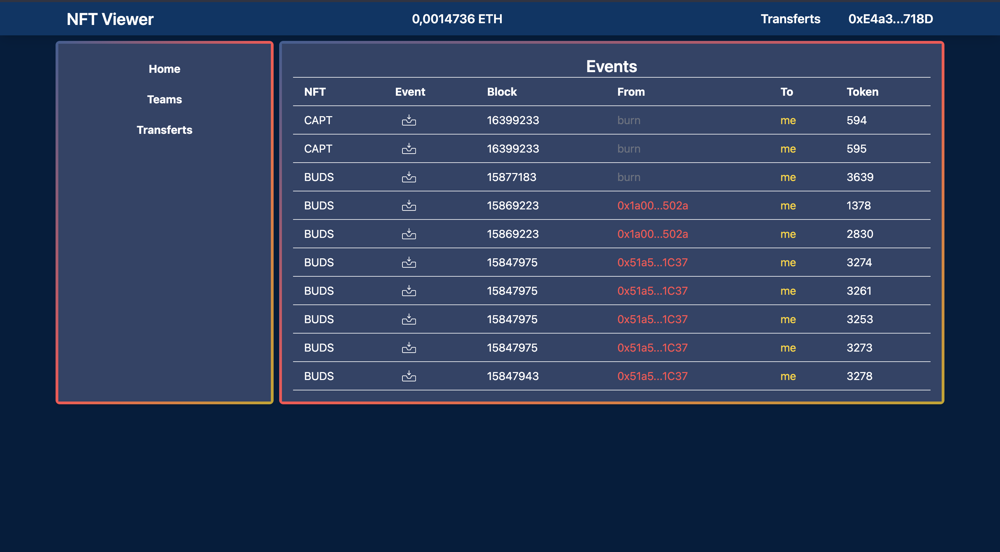

# NFT_Viewer

This project is a second attempt to rebuild my basemint app but this time with some optimization and a better design and trying to use event to show stuff.

This app isn't done yet. I put it aside for a while to work on other projects.

## How to use
There is somes VSCode tasks to run the project.
Just it the watch task to run the project in dev mode.

## Screenshots

## Notes

### Colors palette:
- [Palette](https://coolors.co/palette/000814-001d3d-003566-ffc300-ffd60a)
